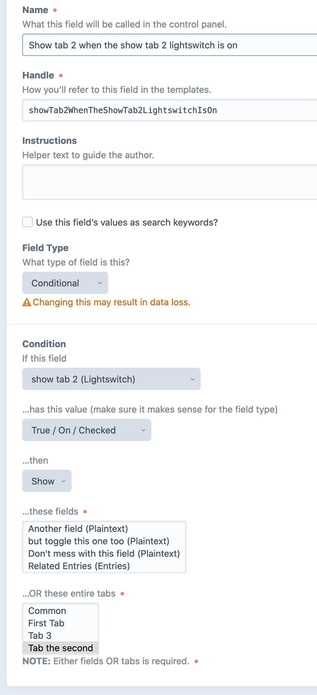
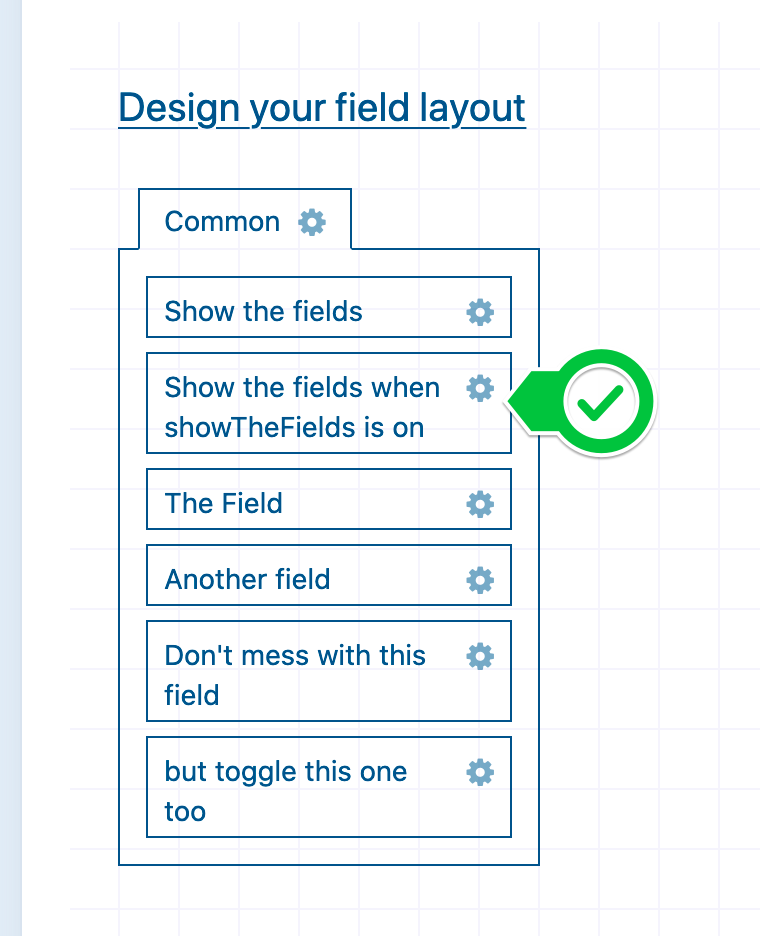
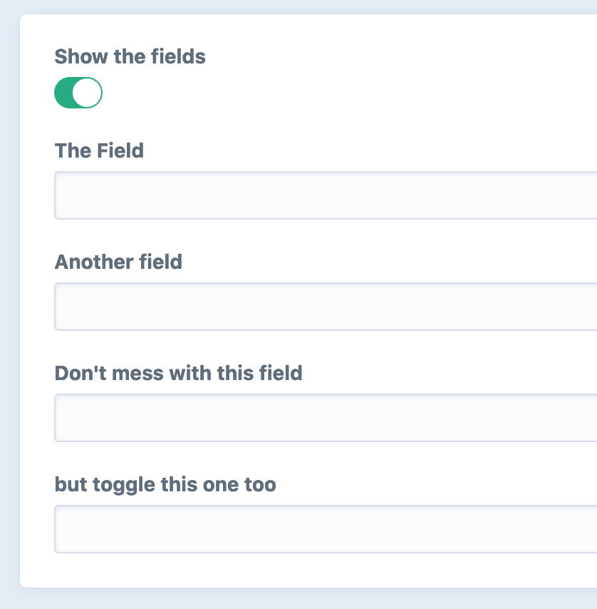
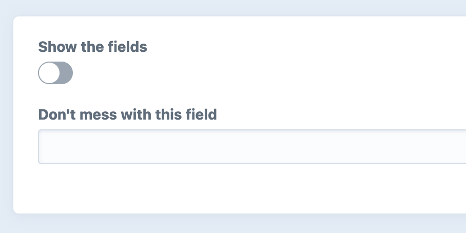
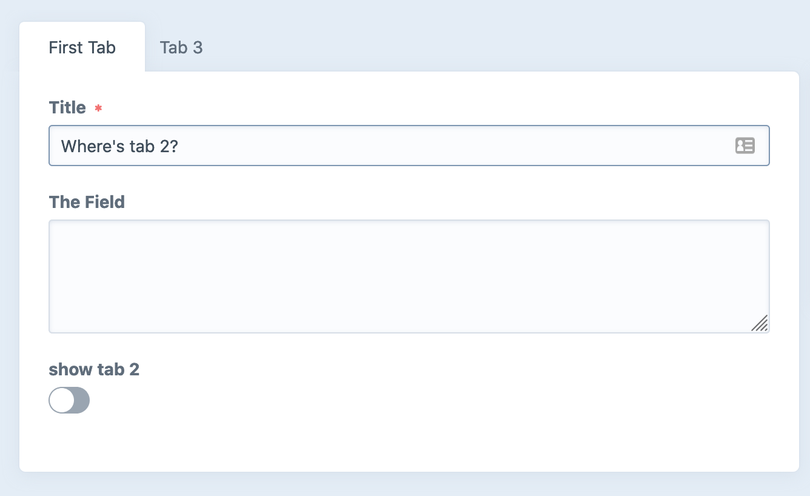
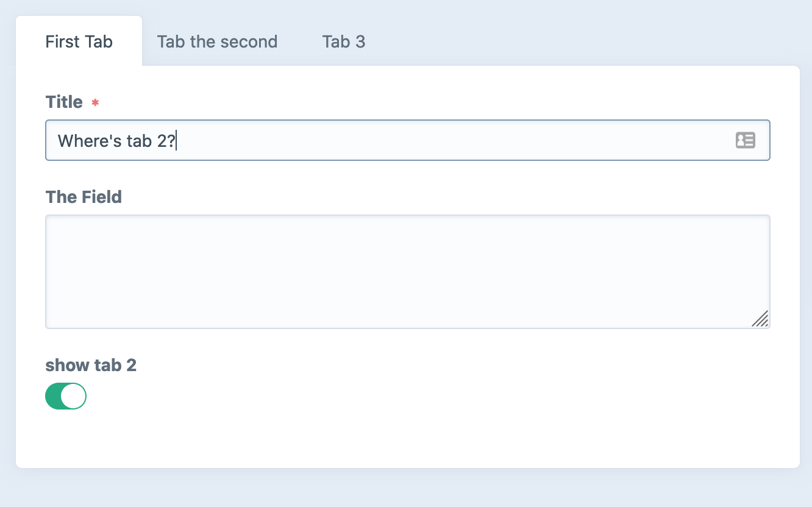

# Conditional Fields plugin for Craft CMS 3.x

## Conditional Fields Overview

Show or hide fields or tabs of fields based on the value of other fields. PRs gratefully received. 

Easy now, this is probably not all you hoped it would be when you saw it was released! That said, please post [any issues](https://github.com/billythekid/conditional-fields/issues) you're having and I'll check them out.

Conditional field layouts are coming to Craft CMS version 4 core. Craft CMS version 2 had the [Reasons plugin](https://github.com/mmikkel/Reasons-Craft) but there's nothing working for Craft 3 at the moment.

This is a very simple, very dumb, implementation of a way to get conditional field layouts in your entries etc.

If you need something complex it's almost certainly not possible with this plugin, but if you just need to show and hide some fields based on simple selections, like light switches, give it a whirl. 
 
## Requirements

This plugin requires Craft CMS 3.4.10 or later. It may work on earlier (^3.0) versions but I've not tested it. I haven't restricted installation to 3.4.10 so give it a go!

## Installation

To install the plugin, follow these instructions.

1. Open your terminal and go to your Craft project:

        cd /path/to/project

2. Then tell Composer to load the plugin:

        composer require billythekid/conditional-fields

3. In the Control Panel, go to Settings → Plugins and click the “Install” button for Conditional Fields.

## Using Conditional Fields

This plugin adds a new available field type called "Conditional".

- Choose a field to watch the value
- Choose what that value should be for this to match and un-match
- Choose whether you want to show or hide the fields based on this value
- Choose the field(s) or tab(s) that should be shown or hidden when matched/unmatched

Creating a conditional field to show/hide fields:

Creating a conditional field to show/hide tabs:

To check for an entry in an entry field, use 'contains' and put the entry ID as the value.

**NOTE:** Chances are that this won't work inside a matrix block or other complicated stuff. Keep it simple.

Once your conditional field is created you can drag it in to any field layouts you want it to work in.

The field itself is invisible to your layout. There are no settings or values to be saved in the layout view, we're just adding functionality so we hide it.

Example of showing/hiding fields:

Example of showing/hiding tabs:

### Dos and Don'ts

#### Do…
- …keep it simple where possible. Light switch fields make great 'togglers' and avoid "magic" for users.
- …add element IDs to 'contains' matches to match if an element field has that element in it.
- …remember that this is a _**visual**_ show/hide. No values are changed in hidden fields, they're just shown/hidden from view. (So if it has a value before it's hidden, that value can and will be used against you in your templates!)
- …add more than one conditional field for different conditions. Just remember that you probably don't want them to work at showing and hiding the same fields.
- …select tab names to conditionally hide a whole tab of fields.
- …report issues, or even better fork it and raise pull requests for features and fixes.

#### Don't…
- …expect too much from this! It's not the most elegant solution to a problem but it kinda works ok-ish for at least some of the time.
- …put multiple IDs in the 'contains' box, that won't work, at least for now.
- …set anything that could be hidden as a required field if it doesn't have a value in it. Your element won't validate and you won't be able to see why!
- …set any "Conditional" fields (the one with the rules in it) to be required in your field layouts, these don't have any values to validate.
- …give different tabs the same name in any one layout. I mean, why would you? This will probably only toggle the first one.
- …hide the tab that the conditional field that hides the tab is on, you'll never get it back.
- …set different conditional fields to operate (show/hide) the same fields in the same layouts. Who knows what will happen‽ Bad things no doubt!
